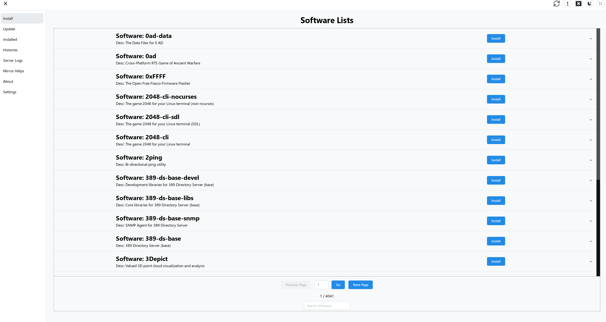

# Tinyget UI

Tinyget is a Python package management tool, handling mainstream system package managers such as apt (used in Debian, Ubuntu, etc.), dnf (used in Fedora, CentOS, etc.) and pacman (used in ArchLinux, etc.).

Tinyget encapsulates the core operations of various package managers, allowing you to interact with them through a unified interface and format.

This project is the gui implementation of Tinyget. The tinyget cli itself is available in its [gitee repository](https://gitee.com/tinylab/tinyget).



## How to use

First you need to install tinyget cli interface and make sure it's in your PATH together with Tinyget UI (the client). Start Tinyget UI will automatically call `tinyget server` as its server.

The GUI now supports list / install / uninstall / search softwares, check system package manager's history logs and update packages info and upgrade system.

## Resources

### GUI Templates

- [modern-desktop-app-template](https://github.com/elibroftw/modern-desktop-app-template)

### Libraries

- [Tauri (JS)](https://tauri.studio/docs/api/js/)
- [Tauri (Rust)](https://docs.rs/tauri/)
- [React Icons](https://react-icons.github.io/react-icons)
- [Mantine Docs](https://mantine.dev/pages/basics/)
- [Mantine Default Theme](https://github.com/mantinedev/mantine/blob/master/src/mantine-styles/src/theme/default-theme.ts)
- [react-i18next Trans Component](https://react.i18next.com/latest/trans-component)
- [prost the protocal buffers implementation](https://github.com/tokio-rs/prost)
- [tonic for gRPC C/S implementation](https://github.com/hyperium/tonic)
- [portable_pty a cross platform API for working with the psuedo terminal](https://docs.rs/portable-pty/latest/portable_pty/)
- [whoami rust for getting the user’s username](https://docs.rs/whoami/latest/whoami/)

## Develop

- [Tauri prerequisites](https://tauri.app/guides/getting-started/prerequisites)
- Install NodeJS via `nvm`
- Install `pnpm` using `corepack enable`
- Install rust
- Install tauri-cli / create-tauri-app by `cargo install tauri-cli` and `cargo install create-tauri-app`
- Install [tinyget](https://gitee.com/tinylab/tinyget) cli interface
- Run `pnpm install` to install frontend dependencies
- Run `cargo tauri dev` or `pnpm dev` for developing. If you use vscode, we also provide the project's debug config.

## Thanks to

- [tauri-terminal](https://github.com/marc2332/tauri-terminal)
- [MirrorZ project for mirror help](https://mirrorz.org)

### In fedora

The deps in fedora 40:

```bash
sudo dnf install libsoup-devel javascriptcoregtk4.0-devel dbus-devel gdk-pixbuf2-devel pango-devel atk-devel rust-gdk-devel cairo-gobject-devel webkit2gtk4.0-devel libayatana-appindicator-gtk3-devel
```

### Some other develop tips

```bash
# release build
cargo tauri build
# debug build
cargo tauri build --debug
# verbose output for checking build problems
cargo tauri build --verbose
# AppImage may need high permissions to build
sudo cargo tauri build
```

On linux will generate deb / rpm and AppImage packages

## TODO List

- [ ] Add Auto Update Functions